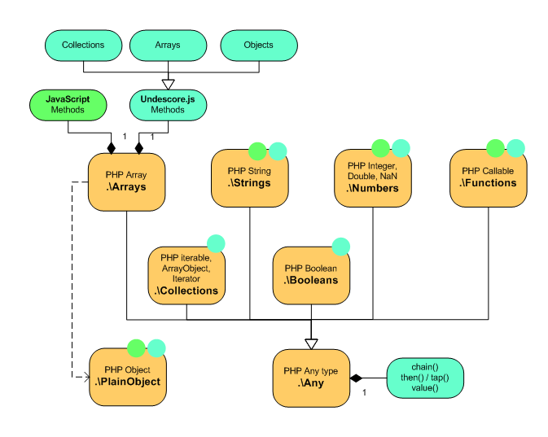

# Dsheiko\Extras

[](https://packagist.org/packages/dsheiko/extras)
[](https://packagist.org/packages/dsheiko/extras)
[](https://packagist.org/packages/dsheiko/extras)
[](https://travis-ci.org/dsheiko/extras)

Collection of chainable high-order functions to abstract and manipulate PHP types.
The library implements JavaScript and Underscore.js functions in PHP

> The packages takes its name from `Array Extras` referring to the array methods added in ES5 (JavaScript) to abstract generic array manipulation logic

## Highlights
- Fixing PHP:
  - Naming convention: all methods are `camelCase` styles vs PHP built-in functions in `lower_case`
  - Consistent parameter order (`Chain::chain($target)->method(...$options)` or `<Type>::method($target, ...$options)`)
  - Methods are chainable
  - Data structure `PlainObject` similar to JavaScript plain object
  - Manipulation target (value) can always be as reference as well as type literal
- Familiar syntax: JavaScript Array/Object/String methods, in addition extra methods in [Underscore.js](http://underscorejs.org/)/[Lodash](https://lodash.com/) syntax
- Performance: package relies on PHP native methods; no `foreach` where a built-in specific function can be used

## Sets

- [Arrays](./wiki/ARRAYS.md)
- [Collections](./wiki/COLLECTIONS.md)
- [Functions](./wiki/FUNCTIONS.md)
- [Strings](./wiki/STRINGS.md)
- [Numbers](./wiki/NUMBERS.md)
- [Booleans](./wiki/BOOLEANS.md)
- [Plain Object](./wiki/PLAIN-OBJECT.md)
- [Any](./wiki/ANY.md)
- [Chaining](./wiki/CHAINING.md)
- [Utilities](./wiki/UTILITIES.md)

## Overview


## Examples

#### None-reference target
```php
<?php
use \Dsheiko\Extras\Arrays;

function numToArray(int $num): array
{
  return [$num];
}
$res = Arrays::map(range(1,3), "numToArray"); // [[1],[2],[3]]
```

#### Chaining methods
```php
<?php
use \Dsheiko\Extras\Any;

$res = Any::chain(new \ArrayObject([1,2,3]))
    ->toArray() // value is [1,2,3]
    ->map(function($num){ return [ "num" => $num ]; })
    // value is [[ "num" => 1, ..]]
    ->reduce(function($carry, $arr){
        $carry .= $arr["num"];
        return $carry;

    }, "") // value is "123"
    ->replace("/2/", "") // value is "13"
    ->then(function($value){
      if (empty($value)) {
        throw new \Exception("Empty value");
      }
      return $value;
    })
    ->value();
echo $res; // "13"

```

#### Accessing methods directly
```php
<?php
use \Dsheiko\Extras\Arrays;

class Foo
{
    public $bar = "BAR";
}

$arr = Arrays::from(new Foo); // ["bar" => "BAR"]

```

#### Plain object
```php
<?php
use \Dsheiko\Extras\Arrays;

$po = Arrays::object(["foo" => "FOO", "bar" => ["baz" => "BAZ"]]);
echo $po->foo; // FOO
echo $po->bar->baz; // BAZ
var_dump($po->bar->entries()); // [["baz", "BAZ"]]
```